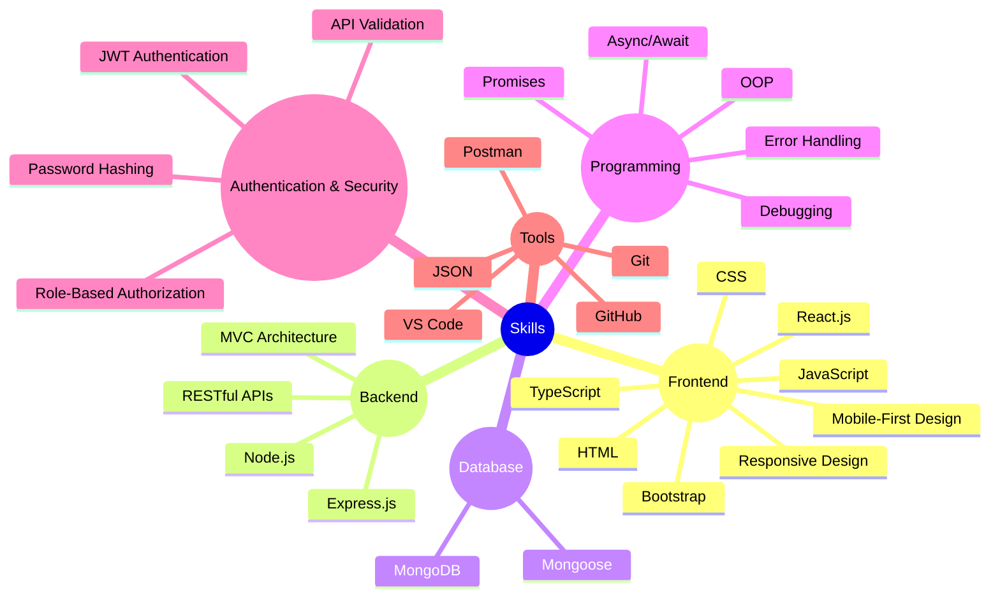

# 👋 Hi, I'm Mohamed Yasser Hassan Fadel

### 💻 Full-Stack Developer | MERN Stack

Computer Science student specializing in **Full-Stack Web Development** and **UI/UX design**. Building responsive, user-friendly web applications using modern technologies, with experience in **frontend, backend, RESTful APIs, authentication, and database management**.

### Tech Snapshot

### 🚀 Projects

* **Course Management System** — Course management platform with Teacher/Student roles, JWT authentication, MongoDB, grades, attendance, and academic records.
* **E-Commerce Platform** — Single-vendor online store with product management, JWT authentication, responsive UI, MERN Stack, and MVC architecture.

### 🎓 Education

**Bachelor of Computer Science — Ongoing**
Institute of Computers & Information – 10th of Ramadan University, Egypt.

### 🔗 Connect with Me

* **WhatsApp:** <a href="https://wa.me/201556451729">01556451729</a>
* **GitHub:** [GitHub profile](https://github.com/mohamed-yasser-0)
* **Email:** [m.yasser.div@gmail.com](mailto:m.yasser.div@gmail.com)
